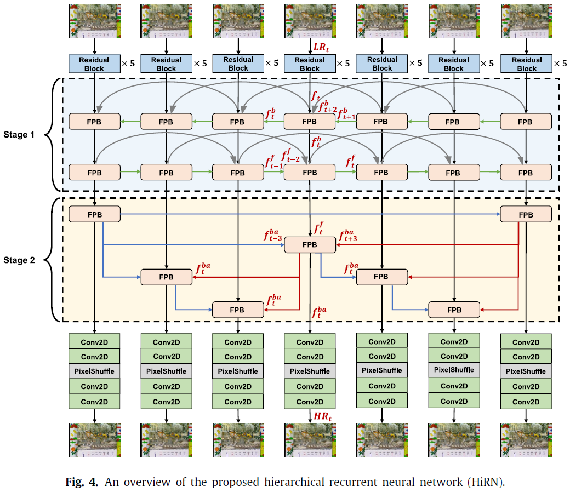
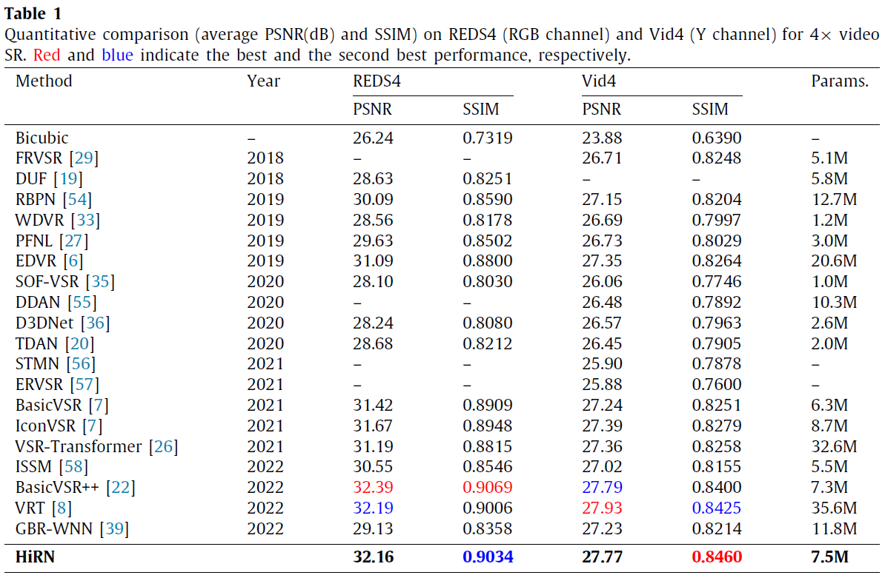
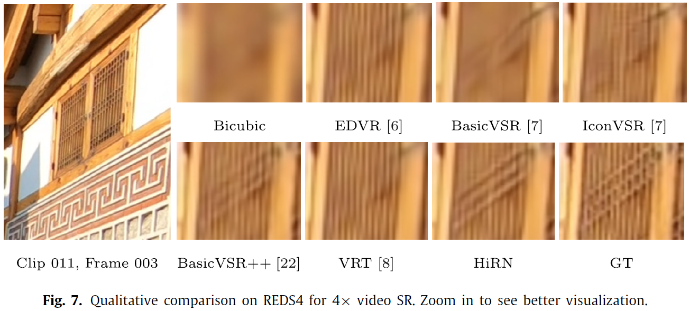
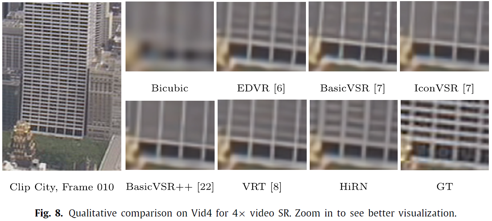

# HiRN: Hierarchical Recurrent Neural Network for Video Super-Resolution (VSR) using Two-Stage Feature Evolution
#### Young-Ju Choi and Byung-Gyu Kim
#### Intelligent Vision Processing Lab. (IVPL), Sookmyung Women's University, Seoul, Republic of Korea
----------------------------
#### This repository is the official PyTorch implementation of the paper published in _Applied Soft Computing (Elsevier)_.
[](https://www.sciencedirect.com/science/article/pii/S1568494623004404)

----------------------------
## Summary of paper
#### Abstract
> _The aim of video super-resolution (VSR) is generate the high-resolution (HR) frames from their lowresolution
(LR) counterparts. As one of the fundamental module of VSR, propagation process provides
the path of feature map and specifies how the feature map is leveraged. In the recurrent propagation,
the latent features can be propagated and aggregated. Therefore, adopting the recurrent strategy can
resolve the limitation of sliding-window-based local propagation. Recently, bi-directional recurrent
propagation-based latest methods have achieved powerful performance in VSR. However, existing
bi-directional frameworks have structured by combining forward and backward branches. These
structures cannot propagate and aggregate previous and future latent features of current branch. In this
study, we suggest the hierarchical recurrent neural network (HiRN) based on feature evolution. The
proposed HiRN is designed based on the hierarchical recurrent propagation and residual block-based
backbone with temporal wavelet attention (TWA) module. The hierarchical recurrent propagation
consists of two stages to combine advantages of low frame rate-based forward and backward schemes,
and multi-frame rate-based bi-directional access structure. The proposed methods are compared with
state-of-the-art (SOTA) methods on the benchmark datasets. Experiments show that the proposed
scheme achieves superior performance compared with SOTA methods. In particular, the proposed
HiRN achieves better performance than all compared methods in terms of SSIM on Vid4 benchmark.
In addition, the proposed HiRN surpasses the existing GBR-WNN by a significant 3.03 dB in PSNR on
REDS4 benchmark with fewer parameters._
>

#### Network Architecture
<p align="center">
  
</p>

#### Experimental Results
<p align="center">
  
</p>

<p align="center">
  
</p>

<p align="center">
  
</p>

----------------------------
## Getting Started
#### Dependencies and Installation
- Anaconda3
- Python == 3.7
    ```bash
    conda create --name hirn python=3.7
    ```
- [PyTorch](https://pytorch.org/) (NVIDIA GPU + [CUDA](https://developer.nvidia.com/cuda-downloads))
    
    Trained on PyTorch 1.12.1 (>= 1.7) CUDA 10.2
    Run in ./
    ```bash
    pip install -r requirements.txt
    BASICSR_EXT=True python setup.py develop
    ```

#### Dataset Preparation
We used [REDS](https://openaccess.thecvf.com/content_CVPRW_2019/papers/NTIRE/Nah_NTIRE_2019_Challenge_on_Video_Deblurring_and_Super-Resolution_Dataset_and_CVPRW_2019_paper.pdf) dataset for training and [Vid4](https://ieeexplore.ieee.org/stamp/stamp.jsp?arnumber=6549107), [REDS4](https://openaccess.thecvf.com/content_CVPRW_2019/papers/NTIRE/Nah_NTIRE_2019_Challenge_on_Video_Deblurring_and_Super-Resolution_Dataset_and_CVPRW_2019_paper.pdf) datasets for testing.

- Prepare for REDS and REDS4

    1) Please refer to **[Dataset.md](https://github.com/YounggjuuChoi/Deep-Video-Super-Resolution/blob/master/Doc/Dataset.md)** in our **[Deep-Video-Super-Resolution](https://github.com/YounggjuuChoi/Deep-Video-Super-Resolution)** repository for more details.
 
    2) Download dataset from the [official website](https://seungjunnah.github.io/Datasets/reds.html).
    
    3) Put the dataset in ./datasets/
    
- Prepare for Vid4

    1) Please refer to **[Dataset.md](https://github.com/YounggjuuChoi/Deep-Video-Super-Resolution/blob/master/Doc/Dataset.md)** in our **[Deep-Video-Super-Resolution](https://github.com/YounggjuuChoi/Deep-Video-Super-Resolution)** repository for more details.
 
    2) Download dataset from [here](https://drive.google.com/drive/folders/1An6hF1oYkeWxfOBxxKm073mvgIFrBNDA).
    
    3) Put the dataset in ./datasets/
 
    4) Generate LR data

       Run in ./scripts/data_preparation/ 

       ```bash
       python generate_LR_Vid4.py
       ```


#### Model Zoo
Pre-trained models are available in below link.

[](https://drive.google.com/drive/folders/1L379h1XRjGC2Bwh5At9MUTbRYm0OXHiN?usp=sharing)


----------------------------
## Training
Run in ./

- Using single GPU

  ```bash
  python basicsr/train.py -opt options/train/HiRN/train_HiRN_REDS.yml
  ```

- Using multiple GPUs
     
  For example, for 4 GPUs, 
  
  ```bash
  CUDA_VISIBLE_DEVICES=0,1,2,3 ./scripts/dist_train.sh 4 options/train/HiRN/train_HiRN_REDS.yml
  ```

----------------------------
## Testing
Run in ./

- Using single GPU

  ```bash
  python basicsr/test.py -opt options/test/HiRN/test_HiRN_REDS.yml
  ```
  ```bash
  python basicsr/test.py -opt options/test/HiRN/test_HiRN_Vid4.yml
  ```

- Using multiple GPUs
     
  For example, for 4 GPUs, 
  
  ```bash
  CUDA_VISIBLE_DEVICES=0,1,2,3 ./scripts/dist_test.sh 4 options/test/HiRN/test_HiRN_REDS.yml
  ```
  ```bash
  CUDA_VISIBLE_DEVICES=0,1,2,3 ./scripts/dist_test.sh 4 options/test/HiRN/test_HiRN_Vid4.yml
  ```
    
----------------------------
## Citation
    @article{choi2023hirn,
      title={HiRN: Hierarchical recurrent neural network for video super-resolution (VSR) Using two-stage feature evolution},
      author={Choi, Young-Ju and Kim, Byung-Gyu},
      journal={Applied Soft Computing},
      pages={110422},
      year={2023},
      publisher={Elsevier}
    }
    
----------------------------
## Acknowledgement
The codes are heavily based on [BasicSR](https://github.com/XPixelGroup/BasicSR). Thanks for their awesome works.

```bash
BasicSR :
@misc{basicsr,
  author =       {Xintao Wang and Liangbin Xie and Ke Yu and Kelvin C.K. Chan and Chen Change Loy and Chao Dong},
  title =        {{BasicSR}: Open Source Image and Video Restoration Toolbox},
  howpublished = {\url{https://github.com/XPixelGroup/BasicSR}},
  year =         {2022}
}
```
